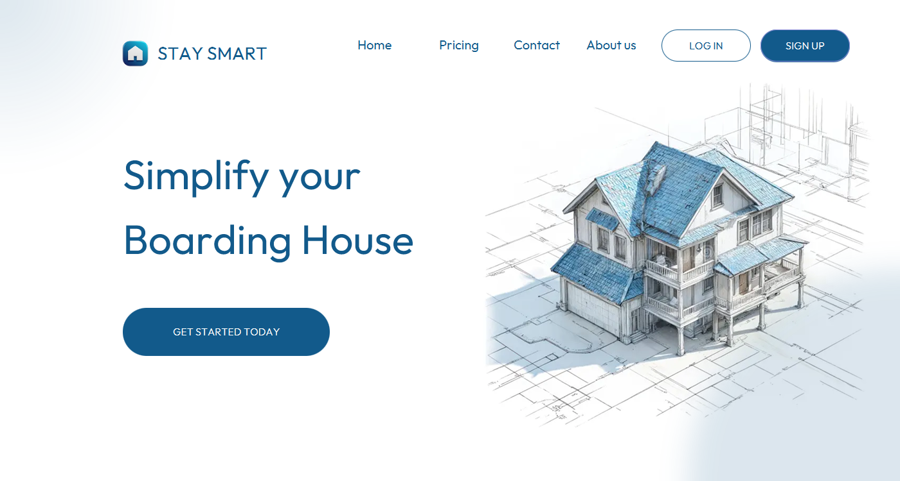
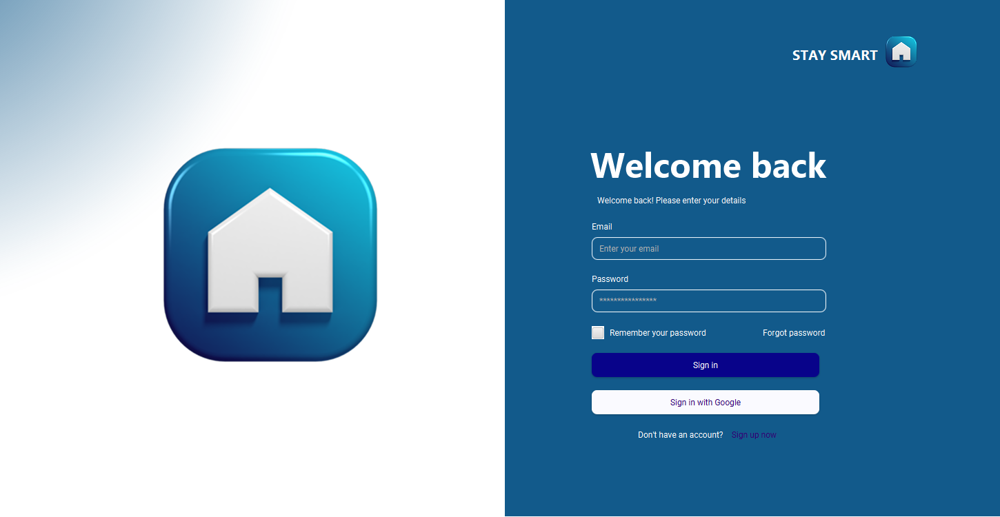
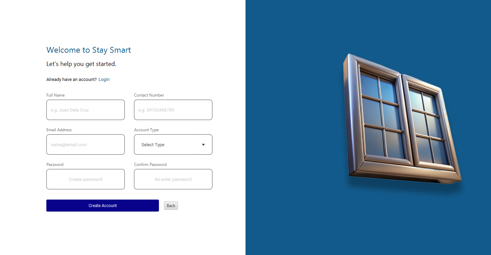
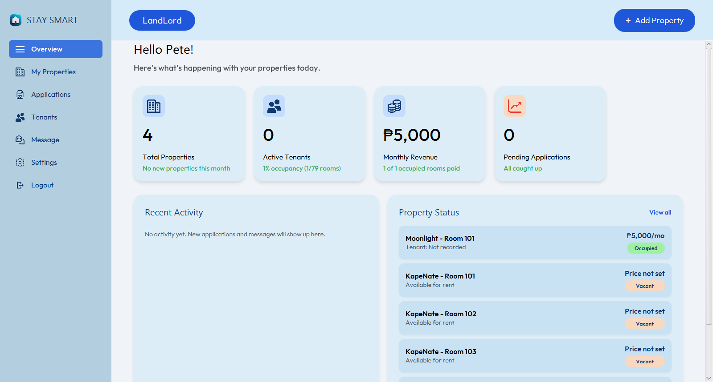
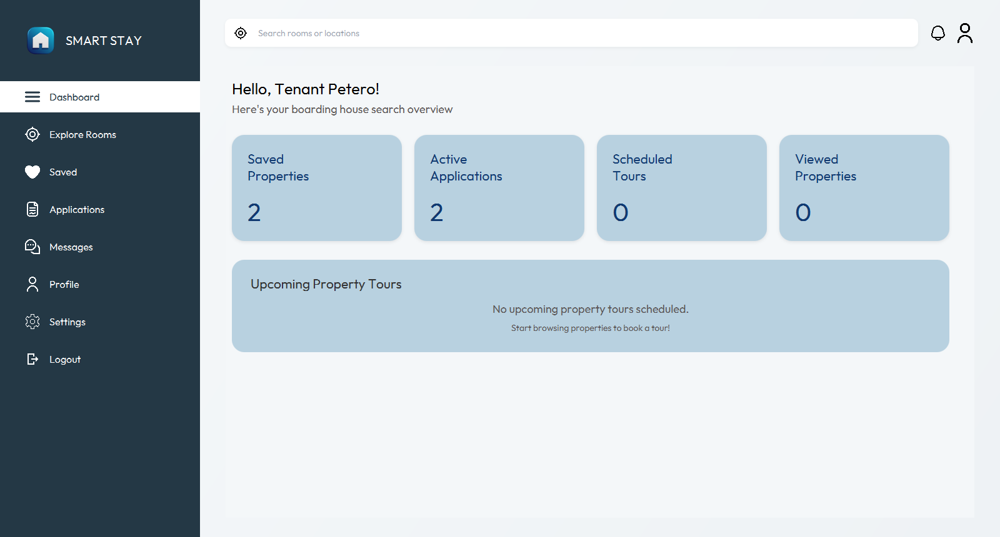
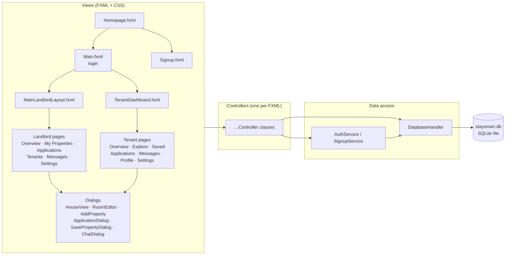
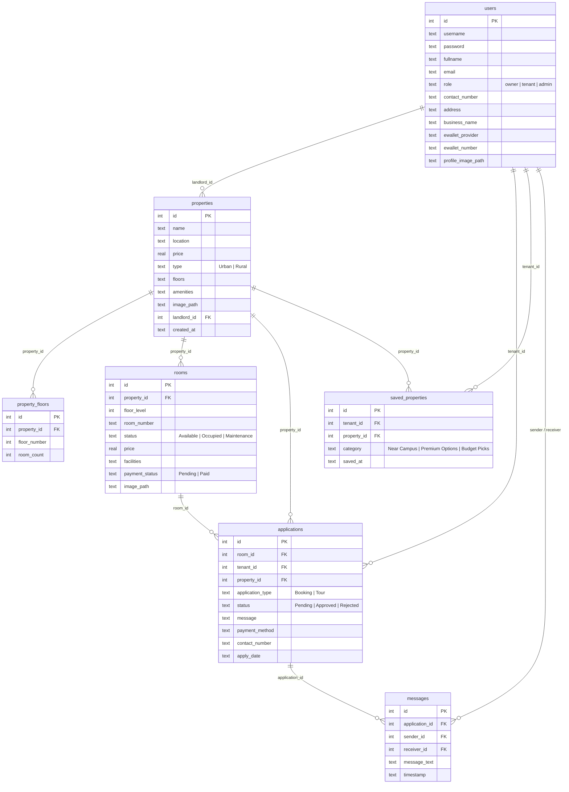

# StaySmart

**A desktop boarding-house management app for landlords and tenants.**

StaySmart connects people who rent out rooms in boarding houses with students and workers looking for a place to stay. Landlords list their properties floor by floor and room by room; tenants browse, save, apply, book tours and chat with the owner — all from one JavaFX desktop application that runs completely offline against a single SQLite file.



---

## Table of contents

- [Purpose](#purpose)
- [Features](#features)
- [Screenshots](#screenshots)
- [Architecture](#architecture)
- [Data model](#data-model)
- [Project structure](#project-structure)
- [How to run](#how-to-run)
- [Default accounts](#default-accounts)
- [Tech stack](#tech-stack)

---

## Purpose

Managing a boarding house is usually done with notebooks, group chats and memory: which rooms are free, who has paid, who asked to visit. Tenants, on the other side, have no single place to compare rooms, keep track of what they applied for, or reach the owner.

StaySmart puts both sides in one app:

- **Landlords (owners)** get a dashboard with live statistics, a visual "house view" of every floor and room, an inbox of applications to approve or reject, a tenant list, and messaging.
- **Tenants** get a searchable catalogue of properties, saved collections, a visual room picker to apply for a room or request a tour, a status view of their applications, and a chat with each landlord.

Everything is stored locally in `staysmart.db`, so the app works without internet, a database server, or any setup beyond Java.

---

## Features

### Landlord / Owner
| Area | What it does |
|---|---|
| **Overview dashboard** | Total properties (and how many were added this month), active tenants and room occupancy, monthly revenue from occupied rooms and how many have paid, pending applications (and how many arrived today), a recent-activity feed and a per-room status panel — all computed live from the database. |
| **My Properties** | Add, edit and delete properties (name, location, price, urban/rural type, number of floors, rooms per floor, amenities, photo). Rooms are generated automatically per floor. |
| **House View** | A drawn building with one row per floor and one tile per room, coloured by status (Available / Occupied / Maintenance). Click a room to edit its price, facilities, photo and payment status, or click "+" to add a room. |
| **Applications** | Booking requests and tour requests from tenants, with approve / reject. Approving a booking marks the room as occupied. |
| **Tenants** | Everyone with an approved booking, with paid/pending counts, contact details and a direct chat button. |
| **Messages** | Conversation per application, with search. |
| **Settings** | Profile (name, address, business info, photo), password change, e-wallet / QR code for payments. |

### Tenant
| Area | What it does |
|---|---|
| **Dashboard** | Saved properties, active applications, scheduled tours and upcoming tour list. |
| **Explore Rooms** | Browse every listed property with search by name or location; open the house view to pick a room. |
| **Apply / Tour** | From a room tile: submit a booking application (with preferred payment method and a message) or request a tour. Occupied rooms can't be applied for. |
| **Saved** | Save a property into a collection (Near Campus / Premium Options / Budget Picks), move it between collections or remove it. |
| **Applications** | Every application with its status badge, and a "Message Landlord" button. |
| **Messages** | Chat per application with the landlord. |
| **Profile & Settings** | Personal info, emergency contact, photo, password and preferences. |

### General
- Email/password sign-up and login with role selection (Tenant / Owner) and duplicate-email protection.
- Fixed-layout pages scale down automatically on smaller screens so the window always fits.
- Custom **Outfit** typeface and a consistent light-blue design across all screens.

---

## Screenshots

| Homepage | Login |
|---|---|
|  |  |

| Sign up |
|---|
|  |

| Owner dashboard |
|---|
|  |

| Tenant dashboard |
|---|
|  |

---

## Architecture

StaySmart is a classic **JavaFX + FXML** desktop application organised as *view → controller → data access → SQLite*. There is no server component.



### Layers

**1. Views** — `src/application/*.fxml` with matching `*.css`. Each page is an FXML document whose root declares its controller (`fx:controller`). The two dashboards (`MainLandlordLayout.fxml`, `TenantDashboard.fxml`) are shells with a sidebar and a `StackPane` content area; navigation swaps the FXML page loaded into that area.

**2. Controllers** — `src/application/*Controller.java`. Plain classes with `@FXML`-injected fields and handlers. They read/write through `DatabaseHandler`, build dynamic UI (cards, room tiles, chat bubbles) in code, and open dialogs. Shared helpers:

| Class | Role |
|---|---|
| `Main` | JavaFX `Application` entry point: loads fonts, opens/creates the database, shows the homepage. |
| `Launcher` | Plain `main()` that delegates to `Main` so the app can be started from the classpath without JavaFX module flags. |
| `AppWindow` | Opens windows consistently: app icon, fixed design size, centred, scaled down to fit small screens. |
| `LoginController` | Also holds the current `User` session (`getCurrentUser()`), read by every page. |
| `LandlordLayoutController` / `TenantDashboardController` | Sidebar navigation and logout. |

**3. Data access** — `DatabaseHandler` owns the JDBC connection and the multi-step queries (dashboard stats, conversations, activity feed, room status, application approval). Controllers with simple CRUD use `DatabaseHandler.getConnection()` directly with prepared statements. `AuthService` and `SignupService` cover login and registration.

**4. Storage** — one SQLite file. On first start `DatabaseHandler`:
1. creates `staysmart.db` (in the working directory, or the path given by `-Dstaysmart.db=…`),
2. runs `db/schema.sql` to create the tables,
3. loads `db/seed.sql` with sample data,
4. applies any pending migrations for files created by older versions.

Foreign keys are enforced, so deleting a property cascades to its floors, rooms, applications and messages.

**5. Models** — `Property`, `User`, `model/Room`, `model/Floor`, `model/Application`, `model/Message`, `model/Activity` are simple value objects passed between the layers.

---

## Data model



---

## Project structure

```
StaySmart/
├── src/application/
│   ├── Main.java, Launcher.java, AppWindow.java      # entry points & window helper
│   ├── DatabaseHandler.java                          # SQLite connection, schema/seed/migrations, queries
│   ├── AuthService.java, SignupService.java          # login / registration
│   ├── *Controller.java                              # one controller per screen or dialog
│   ├── *.fxml                                        # screens and dialogs
│   ├── *.css                                         # styles per screen
│   ├── model/                                        # Room, Floor, Application, Message, Activity
│   ├── db/schema.sql, db/seed.sql                    # database definition and sample data
│   ├── fonts/                                        # Outfit typeface
│   └── images/                                       # icons and illustrations
├── lib/                                              # sqlite-jdbc, slf4j (used when building without Maven)
├── docs/screenshots/                                 # images used in this README
├── pom.xml                                           # Maven build (JavaFX + sqlite-jdbc)
├── run.bat                                           # one-click build & run on Windows
└── staysmart.db                                      # created automatically on first run (git-ignored)
```

---

## How to run

**Requirements:** Java 17 or newer (JDK). Nothing else — no database server, no internet after the first Maven build.

### Option 1 — `run.bat` (Windows, no setup)
Double-click `run.bat`. If Maven is installed it runs `mvn javafx:run`; otherwise it compiles the sources with `javac` against the JavaFX SDK bundled in `StaySmart _App/javafx-lib` and starts the app.

### Option 2 — Maven
```bash
mvn clean compile javafx:run
```

### Option 3 — IntelliJ IDEA
Open the folder (it is imported as a Maven project) and run the **Main** run configuration, or run `application.Launcher`.

### Option 4 — VS Code
Use the **Main** launch configuration in `.vscode/launch.json` (it starts `application.Launcher`).

### Option 5 — plain command line
```bash
java --module-path <path-to-javafx-sdk>/lib --add-modules javafx.controls,javafx.fxml \
     -cp "target/classes;lib/*" application.Main
```

On first launch the app creates `staysmart.db` next to where it was started and fills it with sample data. Delete the file to reset. To keep the database somewhere else, add the VM option `-Dstaysmart.db=C:\path\to\staysmart.db`.

---

## Default accounts

The sample database ships with these logins (password for all: `123`):

| Role | Email |
|---|---|
| Owner / landlord | `pete@gmail.com` |
| Owner / landlord | `testo@gmail.com` |
| Tenant | `zed@gmail.com` |
| Tenant | `test@gmail.com` |
| Admin (opens the owner dashboard) | `admin@staysmart.com` |

Or create your own account from **Sign up** / **Get Started** on the homepage.

---

## Tech stack

| | |
|---|---|
| Language | Java 17+ |
| UI | JavaFX 17+ (FXML, CSS), custom *Outfit* font |
| Database | SQLite via [sqlite-jdbc](https://github.com/xerial/sqlite-jdbc) (embedded, single file) |
| Build | Maven (`javafx-maven-plugin`) or plain `javac` via `run.bat` |
| Logging | SLF4J (no-op binding) |
